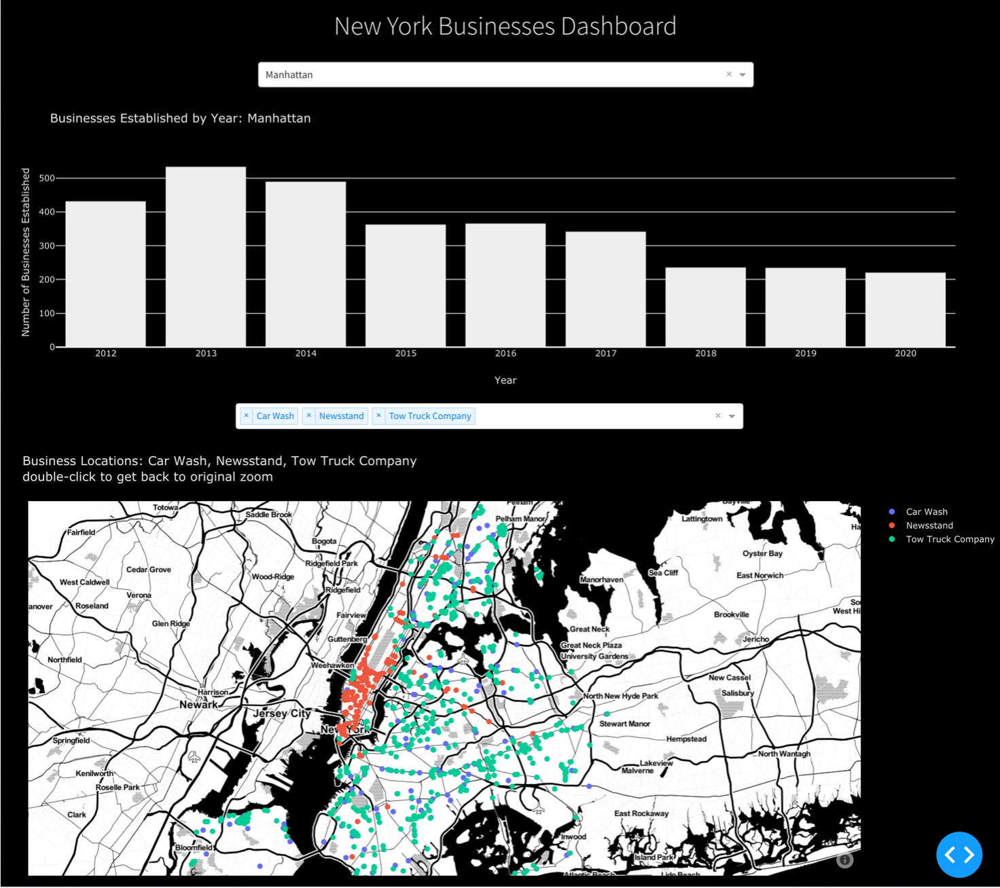

# NYC Open Data
# Analyze NYC businesses data with a simple dashboard
### Uses Plotly's Dash



* Running the app: 

```shell script
pip install -r requirements.txt
python app.py
```

**Data:** [NYC Legally Operating Businesses](https://data.cityofnewyork.us/Business/Legally-Operating-Businesses/w7w3-xahh)